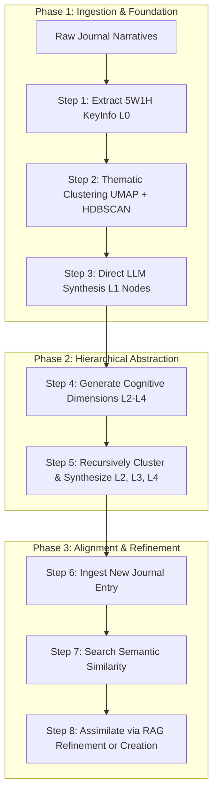

# LingoJourn Monitoring System & Hierarchical Cognitive Graph Pipeline (v2)

An advanced, end-to-end cognitive-behavioral analysis system designed to ingest raw student narrative journals, extract structured patterns, and reconstruct them into an interactive **4-Layer Hierarchical Knowledge Graph (Thinking Model)**. By leveraging state-of-the-art semantic embeddings, clustering algorithms, and Google's Gemini models, the application empowers educators and administrators to monitor, visualize, and dynamically update a student's cognitive and behavioral evolution.

---

## 🌟 What You Can Do With This Application

1. **Dashboard Analytics**: View real-time aggregated metrics such as student journal completion counts, daily/weekly statistics, word counts, and writing time spent.
2. **Interactive Multi-Layered Graph Explorations**: Explore a student's structured thinking patterns using an interactive 2D/3D Force-Directed Graph. Zoom, filter, and inspect specific nodes across the 4 levels of cognitive abstraction.
3. **Hyperparameter Control & Parameter Customization**: Fine-tune the clustering and abstraction settings directly from the UI, adjusting components such as UMAP, HDBSCAN, or target clusters per layer.
4. **Real-time Pipeline Tracking**: Stream detailed build logs in real-time via Server-Sent Events (SSE) while the backend runs complex clustering and LLM synthesis.
5. **Smart Semantic Refinement (RAG Engine)**: Automatically align the cognitive graph when new feedback or structured QA is introduced, updating existing nodes or generating novel insights.

---

## 📂 Project Structure

Below is an overview of the key directories and files in this repository:

```text
d:\GTFI\
├── run.bat                         # Automated Windows server launcher script
├── LICENSE                         # Project licensing and usage restrictions
├── README.md                       # Master documentation (this file)
│
├── gemini_api_client/              # Unified API Client for LLM Orchestration
│   ├── gemini_api_client/
│   │   ├── client.py               # Direct API connector to Google's Gemini
│   │   ├── deepseek_client.py      # Support for Deepseek APIs
│   │   └── unified_client.py       # Unified entry-point with retries & error handling
│   ├── pyproject.toml              # PEP-517 configuration
│   └── setup.py                    # Legacy installation metadata
│
├── admin_back/                     # FastAPI Backend Application
│   ├── requirements.txt            # Python dependencies
│   ├── .env                        # Server configurations & API keys
│   └── app/
│       ├── main.py                 # FastAPI application entry-point
│       ├── database.py             # Mock JSON database engine (database-free)
│       ├── models.py               # Data models (User, Journal, JournalPhase)
│       ├── schemas.py              # Pydantic schemas for API validation
│       ├── security.py             # Security, hashing, and JWT utilities
│       ├── graph_viewer.html       # D3/3D-Force-Graph explorer served inside iframes
│       ├── routers/
│       │   ├── auth.py             # Authentication router (Login/Refresh)
│       │   └── models.py           # Dataset, building, and graph APIs
│       └── model_builder/          # Hierarchical Cognitive Graph Pipeline
│           ├── main.py             # Pipeline orchestrator (Phases 1, 2, and 3)
│           ├── config.py           # Build configuration & hyperparameter defaults
│           ├── llm_handler.py      # LLM request formatters (Time formatting, Synthesis)
│           ├── clustering.py       # UMAP + HDBSCAN + KMeans clustering
│           ├── graph_operations.py # IO and node utilities
│           ├── augmentation.py     # RAG-based model updating engine
│           └── prompts.py          # Strict system and prompt templates
│
└── admin_front/                    # Vite + Vue 3 Frontend Application
    ├── package.json                # Frontend dependencies and scripts
    ├── vite.config.js              # Vite server configuration (Port 5291)
    ├── tailwind.config.js          # Styling configurations
    └── src/
        ├── App.vue                 # Core layout root
        ├── main.js                 # Frontend application bootstrap
        ├── router/                 # Vue Router configurations
        ├── services/               # Axios API service definitions
        ├── stores/                 # Pinia state stores (Auth, Models)
        └── view/                   # Admin pages & visualization layouts
```

---

## 💻 Environment Preparation & Requirements

### Software Versions
- **Python**: `3.10` or higher
- **Node.js**: `18` or higher
- **Package Manager**: `npm` (packaged with Node.js) and `pip` (packaged with Python)

### 1. Python Virtual Environment Setup
It is highly recommended to isolate the project's backend dependencies using a virtual environment:

```bash
# Navigate to the backend directory
cd admin_back

# Create the virtual environment
python -m venv .venv

# Activate the virtual environment
# On Windows (Command Prompt / PowerShell):
.venv\Scripts\activate

# On macOS / Linux:
source .venv/bin/activate
```

### 2. Dependency Installation

#### Backend Setup
With the virtual environment active, install the packages. The package list includes standard scientific libraries (`numpy`, `pandas`, `scikit-learn`), embedding libraries (`sentence-transformers`), clustering libraries (`umap-learn`, `hdbscan`), and security tools:

```bash
# Still inside the admin_back directory with the virtual environment active
pip install -r requirements.txt
```
*(Note: `requirements.txt` automatically installs the local `./gemini_api_client` package in editable development mode.)*

#### Frontend Setup
```bash
# Navigate to the frontend directory
cd ../admin_front

# Install Node modules
npm install
```

---

## ⚙️ Configuration & Environment Variables

Create and edit the `.env` file inside the `admin_back` folder to define the security settings and Gemini API key:

**File**: `admin_back/.env`
```env
SECRET_KEY="a_very_secret_key_that_should_be_changed"
ALGORITHM="HS256"
ACCESS_TOKEN_EXPIRE_MINUTES=43200

# Put your Google AI Studio API Key here
GOOGLE_API_KEY="YOUR_ACTUAL_GEMINI_API_KEY"
```

The frontend routing configuration resides in `.env.development` inside the `admin_front` directory:

**File**: `admin_front/.env.development`
```env
VITE_ADMIN_API_BASE_URL=http://localhost:5290/api
```

---

## 🚀 How to Run the Program

### Method A: Using the Windows Launcher Script (Recommended)
If you are running the program on **Windows**, you can start both the frontend and backend instantly using the provided batch script:

1. Double-click or run `./run.bat` from your terminal at the workspace root:
   ```cmd
   ./run.bat
   ```
2. The script will automatically open two separate command prompt windows (one for Uvicorn running on port `5290` and one for Vite running on port `5291`).
3. Press any key in the controller window to stop both servers cleanly at any time.

---

### Method B: Manual Execution (Cross-Platform)

#### 1. Start the Backend Server (FastAPI)
```bash
# Navigate to the backend folder
cd admin_back

# Activate your virtual environment
# Windows:
.venv\Scripts\activate
# Unix/macOS:
source .venv/bin/activate

# Launch the FastAPI app with Uvicorn
uvicorn app.main:app --host 127.0.0.1 --port 5290 --reload
```
The interactive Swagger API documentation will now be available at `http://127.0.0.1:5290/docs`.

#### 2. Start the Frontend Server (Vite)
```bash
# Open a new terminal window, navigate to the frontend folder
cd admin_front

# Start the Vite development server
npm run dev
```
Open your browser and navigate to `http://localhost:5291` to access the Admin Panel.

---

## 📊 Database & Dataset Format

### Zero-Login & Database-Free Architecture
Rather than relying on a heavy SQL database, this application implements a custom **JSON Database Engine (`database.py`)** that manages data models dynamically. It reads and writes directly from highly-optimized JSON documents located in `admin_back/app/static/datasets`:

1. **`users.json`**: Holds the administrator and student accounts.
2. **`journals.json`**: Contains the full collection of student narrative journals.

### 1. Journal Dataset Format (`journals.json`)
Each entry in the journal list matches the `Journal` schema. Below is a sample journal entry:

```json
{
  "id": 25051130001,
  "user_id": 6,
  "journal_date": "2026-05-10",
  "title": "Struggling with Java Classes",
  "content": "Today's Java session was really difficult. We were writing custom classes and defining setters and getters. I got stuck early on and couldn't figure out how the methods interacted. After talking it over with some study buddies, they explained that setters are used to store data, and getters retrieve it. It makes sense now!",
  "writing_time_spend": 25.5,
  "writing_phase": "completed",
  "created_at": "2026-05-10T15:30:00.000000",
  "updated_at": "2026-05-10T15:55:30.000000"
}
```

### 2. User Dataset Format (`users.json`)
```json
{
  "id": 6,
  "username": "alif123",
  "email": "alif@example.com",
  "realname": "Nur Alif",
  "student_id": "NDHU2026006",
  "group": "A",
  "hashed_password": "$bcrypt-hashed-password-string$",
  "is_admin": false,
  "created_at": "2026-05-01T10:00:00.000000"
}
```

---

## 🧠 How to Build the Cognitive Graph Model

The model builder utilizes a **Cluster-then-Synthesize** approach. You can trigger a new build for a specific student via the UI, choosing from the following **Build Modes**:
- **Full Rebuild (`rebuild_full`)**: Clears all previous cached runs and builds the model completely from step 1.
- **Rebuild L1 Up (`rebuild_l1_up`)**: Retains L0 raw instances but completely re-runs thematic clustering and regenerates layers L1, L2, L3, and L4.
- **Rebuild L2 Up (`rebuild_l2_up`)**: Keeps L0 raw instances and the L1 graph intact, but regenerates higher abstraction dimensions and higher layers (L2-L4).
- **Resume (`resume`)**: Checks for existing layer caches and picks up the pipeline from the last successfully completed step.

### The Pipeline Phases & Steps



#### Phase 1: Foundation (L1 Node Creation)
1. **Step 1: Data Preparation (L0 Ingestion)**: Ingests completed journals (excluding the last few for validation), extracts structured "5W1H" keyinfo instances via LLM, and formats dates into sequential day IDs.
2. **Step 2: Thematic Clustering**: Encodes keyinfo sentences into vectors using a lightweight embedding model (`all-MiniLM-L6-v2`), reduces dimensions using UMAP, and applies HDBSCAN density clustering.
3. **Step 3: L1 Node Synthesis**: Passes each cluster of matching instances to the Gemini model to synthesize unified, high-quality L1 `KnowledgeNodes`.

#### Phase 2: Hierarchical Abstraction (L2 - L4 Node Creation)
4. **Step 4: Dynamic Dimension Generation**: Samples current nodes and generates abstract cognitive dimensions (e.g., "Internal Motivation vs External Scaffolding", "Affective Valence Under Challenge").
5. **Step 5: Dimensional Clustering & Synthesis**: Groups L(n-1) nodes matching these dimensions, and synthesizes higher-level, highly abstract L(n) `KnowledgeNodes`.

#### Phase 3: Model Alignment & Update
6. **Step 6 - 8**: As the student continues writing journals, new entries are digested, compared for similarity with existing L1 concepts, and assimilated dynamically.

---

## 🔍 Retrieval-Augmented Generation (RAG) & Model Alignment Engine

The pipeline implements an advanced **RAG Augmentation Engine (`augmentation.py`)** designed to keep the student's cognitive map aligned with ground truth feedback without triggering expensive rebuilds.

### How the RAG Loop Operates:
1. **Semantic Indexing**: When a user submits a ground-truth Q&A pair from their latest evaluation feedback, the `AugmentationEngine` loads the SentenceTransformer (`all-MiniLM-L6-v2`).
2. **Dense Vector Encoding**: The engine embeds the new ground truth QA pair alongside all existing nodes in the active student model.
3. **Cosine Similarity Search**: It performs a rapid semantic search using cosine similarity:
   $$\text{Similarity} = \frac{\mathbf{u} \cdot \mathbf{v}}{\|\mathbf{u}\| \|\mathbf{v}\|}$$
   This retrieves the top $k=5$ most semantically relevant context nodes in the active graph.
4. **LLM Augmentation Decision**: The prompt passes both the ground truth and the retrieved nodes to Google's Gemini model. The model analyzes the relationship and decides on a single action:
   - **`KEEP`**: The new feedback is already fully and correctly represented. No changes.
   - **`MODIFY`**: The feedback refines or corrects an existing node. The LLM provides updated text to replace the existing content.
   - **`DELETE`**: The feedback proves a specific node is inaccurate or obsolete.
   - **`ADD`**: The feedback introduces a novel behavior or cognitive pattern. A new node (`L{layer}_AUG_...`) is instantiated and linked.

This semantic RAG pipeline ensures that the thinking model remains up-to-date, accurate, and responsive to ongoing feedback with zero downtime.

---

## ⚖️ License & Restrictive Usage

This project is licensed under a restrictive, proprietary software license. Refer to the [LICENSE](file:///d:/GTFI/LICENSE) file in the root directory for full legal terms:
- All rights are reserved.
- You are strictly prohibited from redistributing, publishing, sublicensing, selling, or renting this software, or any modified versions (derivative works), to any third party without explicit written permission from the copyright holder.
- The software is provided "AS IS", without warranty of any kind.
